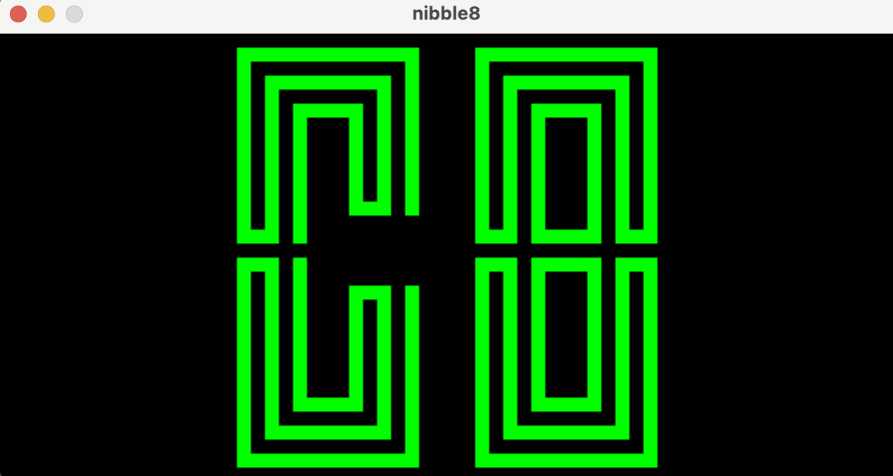

# nibble8

Yet another Rust implementation of a Chip-8 interpreter, using [sdl2](https://crates.io/crates/sdl2).

### Prerequisites

SDL2 development library >= 2.0.5 must be installed. See [here](https://github.com/Rust-SDL2/rust-sdl2#sdl20-development-libraries) for installation instructions.

### Usage
`cargo run --release <path_to_rom.ch8>`
### Todo
- [ ] Complete writing tests for all instructions
- [ ] Improve keyboard input
- [ ] Use a texture to draw rather than copying bit-by-bit
- [ ] Make screen size configurable

### Literature
See the following articles on the Chip 8 instruction set.
- https://tobiasvl.github.io/blog/write-a-chip-8-emulator/
- http://devernay.free.fr/hacks/chip8/C8TECH10.HTM
